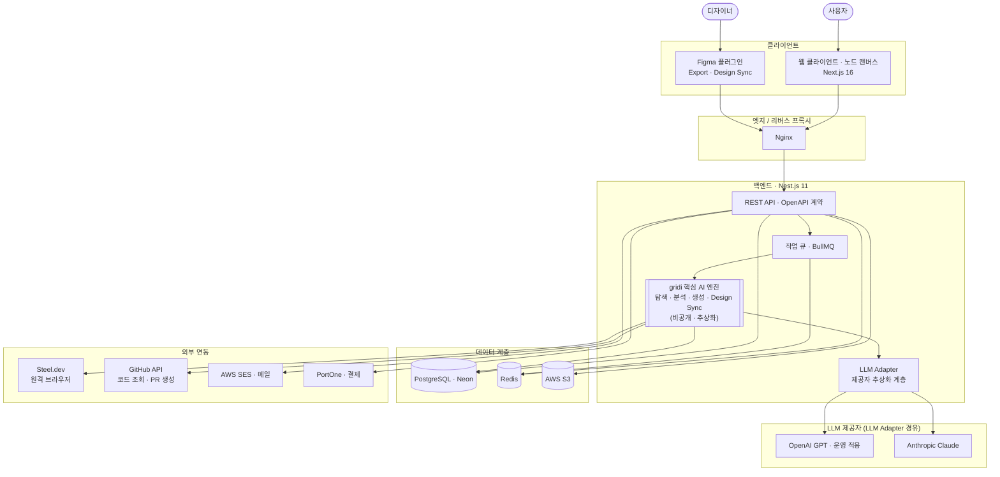
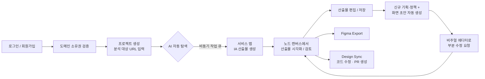

# gridi

> **기획·디자인·개발이 따로 놀지 않게 만드는 AI 워크스페이스**

통합된 맥락(Context)을 바탕으로 기획–디자인–개발을 자동화하는 AI 협업툴(B2B SaaS)입니다.

**2026 PNU AI 해커톤 · 창업트랙 · C-02-gridi 제출물**

<br/>

## 📑 목차

- [1. 프로젝트 소개](#1-프로젝트-소개)
  - [1.1. 개발배경 및 필요성](#11-개발배경-및-필요성)
  - [1.2. 개발 목표 및 주요 내용](#12-개발-목표-및-주요-내용)
  - [1.3. 세부내용](#13-세부내용)
  - [1.4. 기존 서비스 대비 차별성](#14-기존-서비스-대비-차별성)
  - [1.5. 사회적가치 도입 계획](#15-사회적가치-도입-계획)
- [2. 상세설계](#2-상세설계)
  - [2.1. 시스템 구성도](#21-시스템-구성도)
  - [2.2. 사용 기술](#22-사용-기술)
- [3. 개발결과](#3-개발결과)
  - [3.1. 전체시스템 흐름도](#31-전체시스템-흐름도)
  - [3.2. 기능설명](#32-기능설명)
  - [3.3. 기능명세서](#33-기능명세서)
  - [3.4. 디렉토리 구조](#34-디렉토리-구조)
  - [3.5. AI 도구 활용](#35-ai-도구-활용)
- [4. 설치 및 사용 방법](#4-설치-및-사용-방법)
- [5. 소개 및 시연 영상](#5-소개-및-시연-영상)
- [6. 팀 소개](#6-팀-소개)
- [7. 해커톤 참여 후기](#7-해커톤-참여-후기)

<br/>

<a id="본-저장소의-공개-범위"></a>

> ⚠️ **본 저장소의 공개 범위**
>
> 본 저장소는 해커톤 제출용으로, 운영 중인 gridi 서비스 코드베이스에서 **공개 가능한 범위만 선별해 이관**한 것입니다.
> 아래 항목은 영업비밀 보호 및 운영 보안을 위해 **이관하지 않았습니다.**
>
> | 구분 | 제외 대상 |
> |:---|:---|
> | 핵심 AI 엔진 | 서비스 탐색 크롤러, 화면 분석기, 화면 생성기, 분기 분석기, 스타일 지문 추출·비교기 |
> | LLM 프롬프트 | 화면 분석·화면 생성·분기 분석·Design Sync 프롬프트 전문 |
> | Design Sync 엔진 | 저장소 인덱서, 코드 탐색·편집기, 스타일 컨텍스트 검출기, diff 검증기, CSS 해석 유틸 |
> | 변환 엔진 | HTML → Figma 레이어 변환기 |
> | 운영 인프라 | Terraform(IaC), 배포 스크립트, Nginx/모니터링 설정, 운영·정산 스크립트 |
>
> 그 외 **API 계약(OpenAPI), 컨트롤러·DTO·엔티티·타입 정의, 프론트엔드 전체, Figma 플러그인, 테스트 코드,
> 코딩 컨벤션과 AI 개발 환경 설정**은 그대로 포함되어 있어 전체 구조와 설계 의도를 확인할 수 있습니다.
>
> 위 제외 항목 때문에 **본 저장소만으로는 빌드·실행되지 않습니다.** 실제 동작은 [5. 시연 영상](#5-소개-및-시연-영상)에서 확인해 주세요.

<br/>

## 1. 프로젝트 소개

### 1.1. 개발배경 및 필요성

제품 개발팀은 기획자·디자이너·개발자·QA가 **각자 다른 협업툴**(Notion, Jira, Figma, GitHub 등)을 사용합니다. 도구가 늘어날수록 업무 맥락이 분산되고, "같은 맥락"을 유지하기 어려워집니다.

**◦ 분산된 맥락에서 발생하는 문제**

- 기획이 바뀌어도 디자인·코드에 즉시 반영되지 않음 — 변경사항을 파악하고 반영하는 데 **최대 2~3일 소요**, 기획 v3 / 디자인·개발 v2로 버전 불일치 발생
- 과거 의사결정 맥락이 유실되어 변경의 영향 범위를 파악하기 어려움
- 결과적으로 제품 개발 속도 저하 및 커뮤니케이션 비용 증가

**◦ AI 활용의 한계 — "맥락(Context) 부족" 문제**

2026년 2월 발표된 Notion 국내 직장인 AI 활용 조사 결과, AI 활용률은 61.5%에 달하지만 대부분 자료 검색·정보 요약·문서 작성 등 단순 업무에 한정되어 있습니다.

- AI 산출물을 **검증 후 재편집하는 비율 97.5%**
- 불만 요인: **신뢰성 부족(41.6%)**, **일관성 부족(23.7%)**
- 팀원마다 AI의 프로젝트 이해도가 달라, 한 프로젝트 안에서도 직군별 산출물이 어긋남

**◦ 문제 검증**

| 검증 | 방법 | 결과 |
|:---|:---|:---|
| 가설검증 ① | 개인 바이브코더 vs 프로덕트 팀 타겟 랜딩 A/B 캠페인 | 프로덕트 팀 타겟이 **개인 타겟 대비 2배 이상** 전환 |
| 가설검증 ② | 디자이너 타겟 랜딩 캠페인 | 랜딩 전환율 **7.9%**, 사전 신청 전환율 **8.5%** (약 50개사 / 110명) |
| 가설검증 ③ | 시리즈 A~D 스타트업 및 엔터프라이즈 **14개사** 제품 개발팀 인터뷰 | 맥락 공유 부재로 인한 개발 지연·스트레스 사례 반복 확인, AI 산출물 불신으로 휴먼터치 과다 |

> 분산된 맥락을 자동으로 통합하는 도구가 필요합니다. **gridi**는 여기에서 출발했습니다.

<br/>

### 1.2. 개발 목표 및 주요 내용

**통합된 맥락(Context — AI의 메모리 데이터)을 바탕으로 기획–디자인–개발을 자동화**하는 것이 gridi의 목표입니다.

- 분산된 업무 맥락에서 발생하는 **기획–디자인–개발 불일치**를 극복합니다.
- 통합되지 않은 맥락에서 발생하는 **AI 산출물의 신뢰성·일관성 문제**를 극복합니다.
- AI 에이전트와 워크플로우 자동화를 결합하여, 실무자가 **검토자로 진화**하도록 돕습니다.

본 해커톤 제출물은 gridi의 **Phase 1(서비스 맵 자동 분석 및 기획 생성 자동화)과 Phase 2(디자인 산출물 기반 코드 자동 생성)** 를 구현한 결과물입니다.

<br/>

### 1.3. 세부내용

gridi는 단계적으로 기획–디자인–개발 워크플로우 전체를 자동화합니다.

| 단계 | 대상 | 핵심 기능 / 기대 효과 | 상태 |
|:----:|:-----|:----------------------|:----:|
| **Phase 1** | 기획자 · 디자이너 | 서비스 맵(IA) 자동 분석(URL 기반 AI 탐색), 신규 기획·정책·화면 생성 자동화 → 디자인 시스템 구축 기간 **24배↓**, 신규 기능 기획 기간 **10배↓** | **출시 완료** |
| **Phase 2** | 디자이너 · 프론트엔드 | Design Sync — Figma와 실제 배포 코드의 차이를 인식해 코드 수정 및 PR 생성 → 신규 UI 개발 기간 **16배↓** | **출시 완료** |
| **Phase 3** *(26년 말 예정)* | 개발자 · QA | 변경 사항 자동 반영, 테스트 자동화 → e2e 준비 **40배↓**, QA 기간 **3배↓** | 개발 중 |
| **Phase 4** *(27년 초 예정)* | 제품 개발팀 전체 | 기획–디자인–개발 워크플로우 전체 자동화 → 신규 기능 개발 기간 **6배↓** | 예정 |

> *기대효과는 인터뷰·리서치로 확보한 업무별 평균 소요 기간과 자체 테스트 결과를 비교한 수치입니다.*

**기대효과 상세**

- 디자인 시스템 구축: 평균 **24주 → 1주**
- 신규 기능 기획: 평균 **10일 → 1일**
- 한 기업당 연평균 진행 프로젝트: **13개 → 17개**
- **인건비 효율 130% 향상** *(프로젝트 당 평균 4주 소요 가정, 자체 테스트 기준)*

**본 제출물 범위**

- 분석 대상 서비스의 **URL을 입력**하면, AI가 화면을 직접 클릭·탐색하며 서비스 구조를 파악합니다.
- 탐색 결과를 **서비스 맵(IA)** 산출물로 생성하고, 노드 기반 캔버스에서 시각화합니다.
- 수집된 맥락을 바탕으로 **신규 기능의 기획·정책과 화면 초안**을 자동 생성합니다.
- **비주얼 에디터**로 생성된 화면의 요소를 직접 클릭해 수정을 요청할 수 있습니다.
- 산출물을 **Figma로 Export**하거나, **Design Sync**로 코드 저장소에 PR을 생성할 수 있습니다.
- 2026.04.20 오픈 베타 시작 → **정식 출시 완료**, 현재 기업 대상 PoC 진행 중.

<br/>

### 1.4. 기존 서비스 대비 차별성

**◦ 화면 탐색 기능 비교**

| 항목 | **gridi** | html.to.design | ScreenFlow |
|:----:|:---------:|:--------------:|:----------:|
| 타겟 고객 | **스타트업 제품팀** | 개인 | 개인 |
| 숨은 요소 탐색 (모달 등) | **AI가 직접 클릭하여 발견** | △ 사용자가 수동 처리 | ✕ |
| 로그인 이후 화면 분석 | **AI가 사용자에게 로그인 요청하여 탐색** | △ 사용자가 수동 처리 | ✕ |
| 플로우 제공 | **기능 단위별 플로우 제공** | ✕ 페이지 단위 캡처만 | ✕ 개별 화면 리스트만 |

**◦ 화면 생성 기능 비교**

| 항목 | **gridi** | Manyfast | Figma Make |
|:----:|:---------:|:--------:|:----------:|
| 타겟 고객 | **스타트업 제품팀** | 개인/팀 | 개인 |
| 기존 기능 반영 | **수집된 화면 기반 기획** | △ 사용자가 직접 기존 PRD 제공 | △ 사용자가 직접 기존 PRD 제공 |
| 신규 화면 생성 | **기존 톤앤매너 반영한 화면 생성** | ✕ 사용자가 수동 처리 | ○ |
| AI 기반 수정 | **비주얼 에디터 기반 수정** | △ PRD만 수정 가능 | △ 대화 기반 수정만 가능 |

- **스타트업 제품팀 맞춤 설계**: 범용 도구와 달리, gridi는 스타트업 제품팀의 실제 워크플로우에 맞춰진 환경을 제공합니다.
- **사용자 역량과 무관한 효율**: 기존 도구는 사용자 역량에 효율이 비례하지만, gridi는 통합된 맥락을 바탕으로 실무자 관점에서 **즉시 체감되는 AI 전환(AX)**을 이끌어냅니다.
- **자체 기술 기반**: AST(Abstract Syntax Tree) 기반 코드 분석 기술을 자체 개발하여 특허 출원을 완료했습니다.

<br/>

### 1.5. 사회적가치 도입 계획

- **AI 활용 역량 격차 해소**: AI 도입 과도기에는 개인의 AI 활용 능력에 따라 생산성 격차가 심화됩니다. gridi는 통합된 맥락을 누구에게나 동일하게 제공하여, 직군·숙련도와 무관하게 AI의 혜택을 균등하게 누릴 수 있도록 합니다.
- **본질적 업무로의 전환**: 형식적·반복적 업무를 자동화하여, 구성원이 창의적이고 본질적인 문제 해결에 집중하도록 돕습니다.
- **책임 있는 자동 탐색**: 타인의 서비스를 무단으로 수집하지 않도록, 분석 대상 도메인의 **소유권 검증 절차(이메일 도메인 검증 · 증빙 서류 심사)** 를 제품에 내장하고 모든 심사 이력을 감사 로그로 남깁니다.
- **공공 영역 AX 확산**: 중·장기적으로 공공기관 대상 제품을 통해 공공 부문의 디지털 전환(AX)에 기여합니다.
- **지역 창업 생태계 기여**: 부산 기반 청년 창업팀으로서, 부산대학교 창업 인프라와 연계해 지역 창업 생태계 활성화에 기여합니다.

<br/>

## 2. 상세설계

### 2.1. 시스템 구성도

gridi는 **클라이언트 – API – 비동기 처리 – AI 엔진 – 데이터** 계층으로 구성됩니다. 핵심 AI 엔진은 영업비밀 보호를 위해 단일 노드로 추상화하여 표기합니다.



> **LLM Adapter**는 LLM 제공자를 추상화한 계층으로 **OpenAI GPT**와 **Anthropic Claude**를 지원하며,
> 화면 분석·화면 생성·Design Sync 등 **기능(feature) 단위로 제공자와 모델을 지정**할 수 있습니다.
> **현재 운영 환경에서는 모든 기능을 OpenAI API로 호출**하고 있으며, 제공자 교체는 설정 변경만으로 가능합니다.
>
> **원격 브라우저(Steel.dev)** 위에서 Puppeteer(CDP)로 실제 서비스 화면을 조작하며 탐색합니다.
>
> 인프라(AWS Lightsail · Neon · S3 · SES · ECR, Cloudflare DNS)는 전부 Terraform 코드(IaC)로 관리되며,
> GitHub Actions 기반 CI/CD로 Blue/Green 배포됩니다. *(운영 보안을 위해 인프라 코드는 본 저장소에서 제외)*

<br/>

### 2.2. 사용 기술

**◦ Frontend**

| 이름 | 버전 |
|:-----------------------:|:-------:|
| Next.js (App Router) | 16.1.1 |
| React | 19.2.3 |
| TypeScript | 5.x |
| Tailwind CSS | 4.x |
| shadcn/ui (Radix UI 기반) | - |
| ReactFlow (@xyflow/react) | 12.10 |
| Zustand (상태 관리) | 5.0.9 |
| next-intl (다국어) | 4.7 |
| Framer Motion | 12.34 |
| Playwright (E2E) | 1.57 |

**◦ Backend**

| 이름 | 버전 | 용도 |
|:-----------------------:|:-------:|:---|
| Node.js | 20+ | 런타임 |
| Nest.js | 11.0 | 애플리케이션 프레임워크 |
| TypeORM | 0.3.28 | ORM · 마이그레이션 |
| PostgreSQL | 16 | 주 데이터베이스 |
| Redis (ioredis) | 5.9 | 캐시 · 큐 백엔드 |
| BullMQ | 5.69 | 비동기 작업 큐 |
| Swagger / OpenAPI | 3.0 | API 계약 · 문서 |
| Passport (JWT · OAuth) | 11.x | 인증 |
| Puppeteer (CDP) | 24.2 | 브라우저 자동 조작 |
| Steel.dev SDK | 0.16 | 원격 브라우저 세션 |
| OpenAI SDK / Anthropic SDK | 6.22 / 0.39 | LLM 호출 |
| Sharp | 0.34 | 이미지 처리 |
| PortOne SDK | 0.19 | 결제 · 빌링키 |
| nestjs-pino | 4.5 | 구조화 로깅(Loki 연동) |

**◦ Infrastructure**

| 이름 | 용도 |
|:-----------------------:|:-------:|
| Docker / Docker Compose | 컨테이너 환경 |
| Nginx | 리버스 프록시 |
| AWS Lightsail | 애플리케이션 호스팅 (Blue/Green) |
| Neon (Serverless PostgreSQL) | 운영 데이터베이스 |
| AWS S3 · SES · ECR | 스토리지 · 메일 · 이미지 레지스트리 |
| Terraform | 인프라 코드(IaC) |
| GitHub Actions | CI/CD |
| Cloudflare | DNS · 보안 |
| Grafana Loki / Promtail | 로그 수집·조회 |

**◦ 활용한 생성형 AI · AI 코딩 도구** *(필수 기재 항목)*

gridi 팀은 **AI 개발 환경(harness)을 직접 설계·구축**하여, 기획부터 QA까지 개발 전 과정에 AI를 활용했습니다.

**제품 AI 엔진 (서비스 서버)**

| 이름 | 활용 목적 |
|:---|:---|
| **OpenAI GPT** *(운영 적용)* · Anthropic Claude | gridi 제품의 AI 엔진 — LLM Adapter로 멀티 프로바이더를 지원하며, 기능별로 제공자·모델 지정. **현재 전 기능을 OpenAI API로 운영** |

**AI 개발 환경 — 4개 레이어**

| 레이어 | 구성 | 역할 |
|:---|:---|:---|
| Client | **opencode** · Claude Code | AI 코딩 에이전트 실행 환경 |
| Harness | **gridi-crew** *(자체 개발 플러그인)* | 직군별 에이전트(PO·기획·디자인·FE·BE·QA) 워크플로우 자동화 |
| Model | OpenAI · Anthropic | 코드 생성·리뷰에 사용하는 모델 |
| Memory | **claude-mem** | 세션 간 작업 맥락·의사결정 기록의 저장·검색 |

**자체 개발 — 에이전트 확장**

| 구분 | 이름 | 활용 목적 |
|:---|:---|:---|
| 플러그인 | **crew** | 직군별 AI 에이전트의 개발 워크플로우를 순차 자동화하는 자체 플러그인. 자체 마켓플레이스(`gridi-skills`)에 배포 |
| 프로젝트 스킬 | **be-convention-check** | 백엔드 코딩 컨벤션 위반을 6개 카테고리로 병렬 검사·자동 수정하는 자체 스킬 *(본 저장소 `.claude/skills/`에 포함)* |

**활용 플러그인 · MCP 서버**

| 구분 | 이름 | 활용 목적 |
|:---|:---|:---|
| 플러그인 | claude-mem | 세션 간 작업 맥락·의사결정 기록의 저장·검색 |
| 플러그인 | ECC (Everything Claude Code) | 스킬·룰·훅 묶음으로 개발 표준 일괄 적용 |
| 플러그인 | feature-dev · code-review | 기능 개발·코드 리뷰 워크플로우 표준화 |
| MCP | Serena | 심볼 단위 시맨틱 코드 탐색·편집 |
| MCP | Context7 | 라이브러리·프레임워크 최신 문서 실시간 조회 |
| MCP | Figma | 디자인 → 코드 변환 및 디자인–코드 동기화 |
| MCP | GitHub | 이슈·PR·코드 검색 연동 |
| MCP | Playwright | 브라우저 기반 E2E 테스트·시각 QA 자동화 |
| MCP | Notion | 기획 문서·방향성 문서 연동 |

> AI 도구의 단계별 활용 방식과 AI 생성 코드의 검증 절차는 [3.5. AI 도구 활용](#35-ai-도구-활용) 및
> [docs/ai-usage.md](docs/ai-usage.md)에서 상세히 다룹니다.

<br/>

## 3. 개발결과

### 3.1. 전체시스템 흐름도

사용자가 분석 대상 서비스의 URL을 입력하면, gridi가 서비스 맵을 자동 생성하고 신규 기획·화면 초안을 거쳐
Figma 또는 코드 저장소까지 산출물을 내보내는 흐름입니다.



<br/>

### 3.2. 기능설명

> 각 기능의 실제 동작은 [5. 소개 및 시연 영상](#5-소개-및-시연-영상)에서 확인할 수 있습니다.

#### ` 회원가입 / 로그인 페이지 `

- 이메일·비밀번호 입력 시 입력창에서 유효성 검사가 진행됩니다.
- 유효성 검사를 통과하지 못한 경우, 각 경고 문구가 입력창 하단에 표시됩니다.
- 유효성 검사를 통과하면 로그인 버튼이 활성화됩니다.
- **Google · GitHub 소셜 로그인**을 지원하며, **Notion · Figma 계정 연동**으로 외부 도구와 연결할 수 있습니다.
- 로그인 성공 시 JWT 토큰이 발급되고 대시보드로 이동합니다.

#### ` 도메인 소유권 검증 `

- 분석 대상 서비스가 본인·소속 조직의 자산임을 증명해야 프로젝트를 생성할 수 있습니다.
- 회사 이메일 도메인 일치 여부를 자동 판별하고, 일반 메일(Gmail 등)은 증빙 서류 심사로 전환됩니다.
- 심사 승인 시 해당 도메인의 프로젝트가 자동 생성되며, 모든 심사 이력은 감사 로그로 기록됩니다.

#### ` 프로젝트(워크스페이스) 생성 `

- 분석하고자 하는 서비스의 **URL을 입력**하여 새 프로젝트를 생성합니다.
- 입력값이 유효한 URL 형식인지 검증한 뒤, AI 자동 탐색 작업이 시작됩니다.
- 페르소나를 지정하면 해당 관점에 맞춰 탐색 범위와 산출물이 조정됩니다.

#### ` 서비스 맵 자동 분석 `

- 원격 브라우저에서 AI가 **직접 화면을 클릭하며** 서비스 구조를 탐색합니다.
- 모달·드롭다운처럼 링크로 드러나지 않는 **숨은 화면**과, 로그인 이후 화면까지 탐색합니다.
- 탐색은 비동기 작업 큐에서 처리되며, 진행률·현재 탐색 중인 화면이 실시간(SSE)으로 표시됩니다.
- 완료되면 화면 구조·사용자 스토리·정책을 담은 **서비스 맵 산출물**이 생성됩니다.

#### ` 산출물 캔버스 `

- 생성된 서비스 맵을 **노드 기반 캔버스**(ReactFlow)에서 시각화하여 보여줍니다.
- 노드를 클릭하면 스크린샷, 사용자 스토리, 정책, 미검증 항목, HTML을 탭으로 조회할 수 있습니다.
- 텍스트를 클릭하면 그 자리에서 바로 수정되는 인플레이스 편집을 지원합니다.
- 수정한 산출물은 저장되어 이후 기획·화면 생성의 맥락으로 활용됩니다.
- **공유 링크**를 발급하면 계정이 없는 팀원도 산출물을 열람할 수 있습니다.

#### ` 신규 기획 / 정책 / 화면 생성 `

- 기능명과 간단한 설명을 입력하면, 수집된 화면 맥락을 바탕으로 AI가 **기획·정책 초안**을 생성합니다.
- 이어서 기존 서비스의 **톤앤매너를 반영한 신규 화면 초안**을 생성해 캔버스에 새 노드로 추가합니다.
- 생성된 초안은 캔버스에서 검토·수정할 수 있어, 실무자가 검토자 역할로 전환됩니다.

#### ` 비주얼 에디터 `

- 생성된 화면에서 **수정하고 싶은 요소를 직접 클릭**하여 요청 사항을 남깁니다.
- 여러 요소에 대한 요청을 모아 한 번에 제출하면, AI가 **필요한 부분만** 수정합니다.
- 전체 화면을 다시 생성하지 않으므로 기존 디자인이 유지됩니다.

#### ` Figma Export `

- 수집·생성한 화면을 Figma 플러그인을 통해 **편집 가능한 레이어 형태로 내보냅니다.**
- 내보낼 화면을 선택해 한 번에 여러 페이지를 가져올 수 있습니다.
- 텍스트·색상·레이아웃이 Figma 네이티브 요소로 변환되어 디자이너가 곧바로 이어서 작업할 수 있습니다.

#### ` Design Sync `

- Figma 플러그인에서 대상 **저장소와 페이지 경로, 수정할 요소**를 지정합니다.
- AI가 **Figma 디자인과 실제 배포 코드의 차이를 인식**하고, 해당 요소에 대응하는 코드 위치를 찾아냅니다.
- 변경 전/후 코드를 미리 보여준 뒤, 승인하면 **GitHub Pull Request를 자동 생성**합니다.

#### ` 구독 / 결제 `

- Starter · Pro 요금제를 월간/연간으로 구독할 수 있습니다(PortOne 빌링키 기반 정기결제).
- 프로젝트 수·화면 생성 등 기능별 사용량을 관리하며, 추가 사용량 구매를 지원합니다.

<br/>

### 3.3. 기능명세서

| 라벨 | 이름 | 상세 |
|:---:|:----------------------|:---|
| S1 | 회원가입 | - 이메일 형식·중복 검증 <br/>- 비밀번호 정책 검증 <br/>- 이메일 인증 |
| S2 | 소셜 로그인 / 계정 연동 | - Google · GitHub OAuth 인증 <br/>- Notion · Figma 계정 연동 |
| S3 | 로그인 | - 이메일·비밀번호 인증 <br/>- 인증 성공 시 JWT 토큰 발급 |
| S4 | 도메인 소유권 검증 | - 이메일 도메인 자동 검증 <br/>- 증빙 서류 업로드 및 관리자 심사 <br/>- 심사 이력 감사 로그 |
| S5 | 프로젝트 생성 | - 분석 대상 서비스 URL 입력 <br/>- URL 형식 유효성 검증 <br/>- 페르소나 지정 |
| S6 | 서비스 맵 자동 분석 | - 원격 브라우저 세션 기반 AI 자동 탐색 <br/>- 숨은 화면·로그인 이후 화면 탐색 <br/>- 비동기 작업 큐 처리 및 SSE 실시간 진행 상태 |
| S7 | 산출물 캔버스 | - 노드 기반 시각화 <br/>- 노드 상세(스토리/정책/미검증/HTML) 조회 <br/>- 페르소나별 필터 |
| S8 | 산출물 편집 | - 인플레이스 편집 및 저장 |
| S9 | 신규 기획 생성 | - 서비스 맵 맥락 기반 기획·정책 초안 자동 생성 |
| S10 | 신규 화면 생성 | - 기존 톤앤매너를 반영한 화면 초안 생성 <br/>- 캔버스에 분기 노드로 추가 |
| S11 | 비주얼 에디터 | - 화면 요소 클릭 기반 수정 요청 <br/>- 요청 부분만 부분 재생성 |
| S12 | Figma Export | - Figma 플러그인 연동 <br/>- 편집 가능한 레이어로 변환·전송 |
| S13 | Design Sync | - 저장소·페이지·요소 지정 <br/>- 코드 위치 탐색 및 변경안 생성 <br/>- GitHub Pull Request 자동 생성 |
| S14 | 공유 링크 | - 산출물 열람용 공유 토큰 발급 |
| S15 | 구독 / 결제 | - PortOne 빌링키 정기결제 <br/>- Starter / Pro 요금제 <br/>- 기능별 사용량 관리 및 추가 사용량 구매 |
| S16 | 다국어 지원 | - 한국어 / 영어 UI 전환 |

<br/>

### 3.4. 디렉토리 구조

```
PNUAI-C-02-gridi/
├── frontend/                     # Next.js 16 클라이언트
│   ├── messages/                 # 다국어 리소스 (ko / en)
│   └── src/
│       ├── app/                  # App Router — (auth) (canvas) (dashboard) (public) admin
│       ├── components/           # 재사용 UI 컴포넌트
│       ├── api/                  # OpenAPI 자동 생성 API 클라이언트
│       ├── stores/               # Zustand 전역 상태
│       ├── hooks/ lib/ constants/ types/
├── backend/                      # Nest.js 11 API 서버
│   └── src/
│       ├── auth/                 # 인증·인가 (JWT · Google/GitHub/Notion/Figma OAuth)
│       ├── users/                # 사용자 · 계정 연동
│       ├── explorationProjects/  # 프로젝트 · 서비스 탐색 · 페르소나 · 공유 링크
│       │   ├── exploration/      #   탐색 도메인 (컨트롤러 · DTO · 엔티티 · 타입)
│       │   ├── browserSessions/  #   원격 브라우저 세션 (Steel.dev)
│       │   └── figmaExport/      #   Figma Export
│       ├── designSync/           # Design Sync — 변경 요청 · 코드 편집 · GitHub PR
│       ├── domainVerification/   # 분석 대상 도메인 소유권 검증 · 감사 로그
│       ├── payment/              # 구독 · 결제 · 사용량 (PortOne)
│       ├── llm/                  # LLM Adapter (OpenAI · Anthropic)
│       ├── admin/ mail/ notifications/ health/ common/ config/ constants/
│       └── migrations/           # TypeORM 마이그레이션
├── figma-plugin/                 # Figma 플러그인 (Export · Design Sync)
├── docs/                         # OpenAPI 스펙 · 코딩 컨벤션 · 제출 문서
├── .claude/                      # 프로젝트 지침 + 자체 개발 스킬(be-convention-check)
├── .github/workflows/            # CI 파이프라인
├── _archive/                     # 해커톤 README 템플릿 보관
└── docker-compose.dev.yml        # 로컬 개발용 PostgreSQL · LocalStack
```

> ⚠️ 상단 [공개 범위 안내](#본-저장소의-공개-범위)에 명시한 대로, 각 도메인의 **컨트롤러·DTO·엔티티·타입 정의는 포함**되어 있으나
> **핵심 AI 엔진·프롬프트·코드 분석 알고리즘 파일은 이관하지 않았습니다.**

<br/>

### 3.5. AI 도구 활용

gridi는 **개발 과정 전 단계**에서 AI 도구를 활용했습니다.

| 단계 | 활용 도구 | 활용 방식 | 성과 |
|:----:|:----------|:----------|:-----|
| **기획** | opencode · Claude Code + crew | 사용자 스토리·와이어프레임 초안 자동 생성 | 기획 산출물 작성 시간 단축 |
| **디자인** | Figma + Figma MCP | 디자인 시스템 구성, 디자인–코드 연동 | 디자인-개발 핸드오프 비용 절감 |
| **개발** | opencode · Claude Code + crew | 프론트엔드·백엔드 코드 생성, 컨벤션 검사, 코드 리뷰 | 일관된 컨벤션 유지, 구현 속도 향상 |
| **테스트** | Claude Code + Playwright MCP | E2E·단위 테스트 코드 작성 및 시각 QA | 테스트 커버리지 확보 |
| **제품 서비스 서버** | LLM Adapter (OpenAI GPT 운영 적용 · Anthropic Claude 지원) | gridi의 탐색·기획·화면 생성 엔진 | 제품 핵심 기능 구현 |

- **AI 페어 프로그래밍**: 정해진 코딩 컨벤션(계층형 아키텍처·Contract-First API 등)을 일관되게 적용하며 빠르게 구현했습니다.
- **제품 자체가 AI 기반**: gridi의 탐색·생성 기능은 **LLM Adapter**로 추상화되어 있어 OpenAI GPT와 Anthropic Claude를 모두 지원하며, 기능 단위로 제공자·모델을 지정할 수 있습니다. 현재 운영 환경에서는 전 기능을 **OpenAI API**로 호출합니다.
- **성과**: AI 도구로 단순·반복 작업을 위임하고, 팀은 아키텍처 설계와 검증에 집중할 수 있었습니다.

#### 하네스 엔지니어링 — AI 개발 환경 자체를 설계

gridi 팀은 AI 코딩 도구를 단순히 "사용"하는 데 그치지 않고, AI가 **일관되고 신뢰할 수 있는 산출물**을 내도록 개발 환경(harness) 자체를 설계·엔지니어링합니다. 이는 gridi 제품이 지향하는 가치 — *통합된 맥락으로 AI 산출물의 신뢰성·일관성을 확보한다* — 와 **동일한 철학을 팀 내부 개발 과정에 먼저 적용**한 것입니다.

| 엔지니어링 축 | 구성 | 효과 |
|:---|:---|:---|
| **컨텍스트 엔지니어링** | claude-mem 기반 세션 관측(observation) 기록·검색, 프로젝트 메모리 인덱스 | 세션이 바뀌어도 의사결정 맥락이 유지되어, AI가 매번 배경을 다시 학습하지 않음 |
| **멀티 에이전트 워크플로우** | 자체 개발 `crew` 플러그인 — 직군별 에이전트를 파이프라인으로 구성 | 백로그 → 유저스토리 → 설계 → 구현 → QA를 표준 순서로 자동 진행 |
| **컨벤션 코드화** | 전역 rules + 프로젝트 `CLAUDE.md`에 아키텍처·네이밍·코드 스타일 명문화 | AI 산출물이 항상 동일한 규칙을 따름 — 사람·세션 간 편차 제거 |
| **결정론적 가드레일** | Hooks(SessionStart·PostToolUse 등)로 컨텍스트 주입·포맷·린트·컨벤션 검사 자동화 | 확률적 *생성*은 AI에, *검증*은 결정론적 훅에 분리하여 품질 보장 |
| **도구 통합** | MCP 서버로 Figma·GitHub·Notion 등 외부 시스템을 에이전트 도구로 연결 | 디자인·형상관리·기획 문서를 AI 워크플로우 안으로 통합 |

- **자동화 단위는 "도구"가 아니라 "워크플로우"**: 단일 프롬프트가 아니라, 직군별 에이전트·룰·훅·메모리가 결합된 *재현 가능한 파이프라인*을 운영합니다.
- **생성과 검증의 분리**: 창의적 생성은 AI가, 컨벤션·빌드·테스트 검증은 결정론적 훅이 담당하여 산출물 품질을 구조적으로 보장합니다.
- **드리프트 방지**: 컨텍스트·컨벤션을 코드화해 두어, 세션이 바뀌거나 담당자가 달라져도 산출물이 어긋나지 않습니다 — gridi가 제품으로 해결하려는 *기획–디자인–개발 불일치* 문제를 개발 환경 차원에서 먼저 검증한 셈입니다.

<br/>

## 4. 설치 및 사용 방법

> ⚠️ 상단 [공개 범위 안내](#본-저장소의-공개-범위)에 명시한 대로 핵심 AI 엔진이 제외되어 있어,
> **본 저장소만으로는 빌드·실행되지 않습니다.** 아래는 전체 코드베이스 기준의 실행 절차이며,
> 구조와 개발 방식을 확인하기 위한 참고 자료입니다. 실제 동작은 [시연 영상](#5-소개-및-시연-영상)을 참고해 주세요.

### 필요 환경

- Node.js 20 이상
- Docker & Docker Compose
- Git

### 설치 및 실행

```bash
# 1. 저장소 클론
$ git clone https://github.com/PNU-2026-AI-Hackathon/pnuai-c-02-gridi.git
$ cd pnuai-c-02-gridi

# 2. 의존성 설치 (루트 + frontend + backend)
$ npm run install:all

# 3. 개발용 데이터베이스 실행 (PostgreSQL · LocalStack)
$ npm run dev:db

# 4. 백엔드 환경변수 설정
$ cp backend/.env.example backend/.env

# 5. DB 마이그레이션 실행
$ cd backend && npm run migration:run && cd ..

# 6. 프론트엔드 + 백엔드 동시 실행
$ npm run dev
```

### 자주 쓰는 명령어

| 명령어 | 설명 |
|:---|:---|
| `npm run dev:all` | DB 기동 + 프론트/백엔드 동시 실행 |
| `npm run api:generate` | OpenAPI 스펙에서 프론트/백엔드 타입·클라이언트 재생성 |
| `npm run lint` | 프론트엔드 + 백엔드 린트 |
| `npm run test` | 백엔드 단위 테스트 |

> **Contract-First**: `docs/openapi.yaml`이 단일 진실 원천이며, 스펙을 먼저 수정한 뒤
> `npm run api:generate`로 프론트엔드 API 클라이언트와 백엔드 타입을 재생성합니다.

### 접속 주소

| 구분 | 주소 |
|:----:|:-----|
| 프론트엔드 | http://localhost:3000 |
| 백엔드 API | http://localhost:4000/api |
| API 문서 (Swagger) | http://localhost:4000/api/docs |

> AI 기능을 실행하려면 `.env`에 LLM 제공자 API 키(운영 기준 `OPENAI_API_KEY`, 대체 제공자 사용 시 `ANTHROPIC_API_KEY`)와
> 원격 브라우저(Steel.dev) API 키가 필요합니다.

<br/>

## 5. 소개 및 시연 영상

[https://youtu.be/kxhyJP5tvFE?si=CjSwc3lAA53JKvn9](https://youtu.be/kxhyJP5tvFE?si=CjSwc3lAA53JKvn9)

<br/>

## 6. 팀 소개

| 대표 | 팀원 | 팀원 |
|:----:|:----:|:----:|
|  |  |  |
| **김륜영** | **김유진** | **김지윤** |
| CEO · 에이전트 설계 | 엔지니어 · 풀스택 개발 | 엔지니어 · 풀스택 개발 |
| rycando@pusan.ac.kr | 0505ujin@pusan.ac.kr | kims0509@pusan.ac.kr |
| 부산대 정보컴퓨터공학부 | 부산대 정보컴퓨터공학부 (인공지능) | 부산대 IT응용공학과 |
| TypeScript · Node.js · Nest.js | TypeScript · React · Next.js | Java/Spring · Swift · TypeScript |
| 크래프타·당근·모두싸인 백엔드 개발 | 대통령과학장학생, DILAB 학부연구생 | Apple Developer Academy @POSTECH 3기 |

**팀 이력**

- 2025.04 팀빌딩 후 3번의 피봇 → 2026.01.21 **gridi 프로젝트 시작** → 정식 출시 완료 및 PoC 진행 중
- 약 **50개사 / 110명**의 사전 예약 확보, 인스타그램 누적 조회수 **7만회** 달성
- **부니콘 씨드 최우수 선발**, **부산대학교 창업중심대학 선발**

**주요 수상 이력**

- 2026 부산 90일 챌린지 데모데이 최우수상
- 2026 꿈터플러스 제4회 대학생 창업 아이디어 경진대회 대상
- 2025 제6회 PNU 창의 융합 해커톤(창업트랙) 대상 (부산대학교 총장상)
- 2025 제6회 부울경 ICT 아이디어 경진대회 대상 (울산광역시장상)
- 2025 전국 ICT 이노베이션 스퀘어 SW 공모전 최우수상 (충청북도지사상)
- 2025 예비창업패키지 일반분야 B.Startup 사전인큐베이팅 프로그램 금상
- 2025 PNU dream beats 창업 경진대회 창업지원단장상 / 금정 유스콘 창업 경진대회 대상

<br/>

## 7. 해커톤 참여 후기

- **김륜영**
  > 해커톤을 통해 현재 진행 중인 창업의 개발 속도를 더 몰입해서 올릴 수 있었고, 다른 팀과 경쟁하면서 성장을 위한 자극을 받을 수 있었습니다. 앞으로는 더 성장해서 후배들에게 좋은 영향력을 줄 수 있는 창업 선배로 성장하고 싶습니다.
- **김유진**
  > 이번 기회를 통해 진심을 다해 창업에 몰입하는 좋은 팀원들을 만날 수 있어서 좋았습니다. 개인적으로 전공과 관련하여 기술적으로 많이 배워서 뜻깊었습니다.
- **김지윤**
  > 다양한 강의가 체계적으로 구성되어 있어 좋았으며, 어려운 부분이 있을 때 질의응답을 통해 궁금증을 해결할 수 있다는 점이 특히 유익했습니다. 또한 여러 강의를 통해 기존에 알지 못했던 새로운 관점과 인사이트를 얻을 수 있는 기회가 많아 만족스러웠습니다.

<br/>

---

<p align="center">
  <b>gridi</b> · 기획·디자인·개발이 따로 놀지 않게 만드는 AI 워크스페이스<br/>
  2026 PNU AI 해커톤 · 창업트랙 · C-02-gridi
</p>
